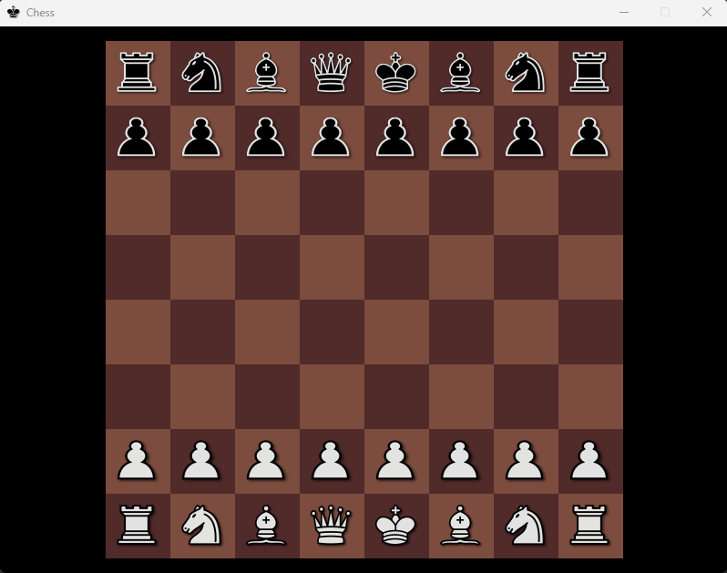

## Introduction
Classic game of chess. This is a functional chessboard with all the pieces and a manual mouse picking mechanic.
There is no functionality to play against AI. Created with Pygame.

## Functionality
- Chessboard is built from scratch with the images of sqaures in the 'graphics' folder.
- The program creates dictionaries with all the x and y values for squares and positions for pieces.
- Pieces from the 'graphics' folder are drawn on the chessboard to their initial positions.
- Game can be operated with mouse drag & drop mechanic.
- The program checks for a collision if trying to drop a piece onto another piece.
- There is also a snap mechanic, so the dropped piece centers itself onto the corresponding square under the mouse cursor.

## Installation
No installation. Run it in a Python interpreter or terminal.
When executed, a separate window is drawn and the while loop in the 'main' module handles the updates. Close the window to quit.